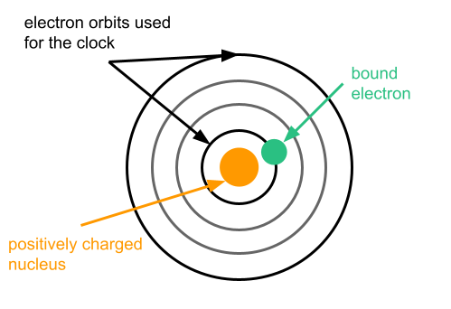
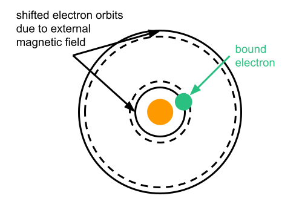

# Tutorial 2 - Quantum metrology

Welcome back to our second lesson on quantum technologies. In this lesson, we will discuss how quantum systems are used for precise measurements in a variety of situations. We saw in the last lesson, that quantum physics was initially developed to explain some observations in the laboratory. However, in the 1960s and 1970s more and more lasers became accessible as a new tool for experimental physicists. They allowed brave pioneers to cool and trap individual particles. This work was purely curiosity-driven and was launched in a tiny number of university and government laboratories. It suddenly allowed people like Dave Wineland, Bill Phillipps or Claude Cohen-Tannoudji a previously unimaginable degree of control over atoms and ions. This kind of work had such an important impact on physics that it was recognized with several nobel prizes and is now used to define our measurement units like the second, the meter etc.

We will go through three specific examples and see how quantum technologies are used there.

1. The measurement of time is nowadays done with atomic clocks and so precise that clocks can be used for the measurement of height.
2. The measurement of magnetic fields is getting more and more precise thanks to quantum technologies. We are now even able to measure the magnetic fields that are created by brain activity.
3. Measurement of forces are essential for navigation of planes and large ships. Quantum technologies are an essential tool to improve these measurement to a stage where satellites are not needed anymore.

## Measuring time with atomic clocks

Precise time keeping is essential to mondern industry. Financial services are highly timed, navigation depends on the precise timing of the GPS satellites and we are all following the same time of the network time protocol. And nowadays time is kept with increasingly precise atomic clocks, which are one of the earliest quantum technologies we have. A few reasons which atomic clocks are such marvelous time keepers are:

- No need to get the american, chinese or european atom as they are all equal. Once we agreed with other how we measure time with atoms we all have exactly the tools at hand.
- Atomic clocks a extremely precise. Commercially available rubidium clocks (for a few thousand euros) are precise to within 10^{-11}. Modern research has push this to 10^{-21} as described in this paper.

## How do atomic clocks roughly ?

You might have heard that atoms consist of a nucleus which is positively charged and a bunch of negatively charged electrons circling around this nucleus. And as for satellites that orbit around earth, their speed is different in different orbits. So, electrons that are closer to the core, in a lower orbit, take less time to circle around the core than electrons that that further away, in a higher orbit. And it was one of the first discoveries by quantum mechanics that only a number of very specific orbits with sharply defined frequencies are allowed. 

And then then electrons can then jump from one orbit to another if you shine in microwave radiation at the corresponding frequency. Yes, it is the same kind of radiation that heats up your food in the microwave oven. Except that here the radiation does not heat the atom it just makes the electron jump to another orbit. And this highly controlled transition of the electron between two orbits is what atomic clocks are building upon. Actually, we have now defined the second based on this idea. The definition reads:

>
> The second, symbol $s$, is the SI unit of time. It is defined by taking the fixed numerical value of the caesium frequency $\Delta \nu_\text{Cs}$, the unperturbed ground-state hyperfine transition frequency of the caesium-133 atom, to be 9 192 631 770 when expressed in the > unit Hz, which is equal to $s^{-1}$.
> 
> From the website of the [bureau international des poids et des measures](https://www.bipm.org/en/si-base-units/second).

If you have some time, we also recommend you to have a look into the [talk by Nobel prize Bill Philipps](https://youtu.be/8WWQrD_TzaY), where he gives a highly entertaining introduction.

A more scientific discussion can be found in this [detailled review](https://arxiv.org/abs/1407.3493) paper.

## Measuring magnetic fields

[Compasses](https://en.wikipedia.org/wiki/History_of_the_compass) have been used for navigation of 2000 years now. This makes the measurement of magnetic field is one of the long standing tools of navigation that we have. And the precise measurement of magnetic fields remains a major industrial challenge, where the most precise magnetometers are nowadays based on quantum technologies. Most of them of a similar approach as they measure the influence of the magnetic field on electrons. The existence of the magnetic field slightly changes how the electrons would like to move. So looking back to the electrons in an atom, it means that the frequency of each orbit is shifted slightly. And as all the orbits are slightly different, each of them experiences a slightly different energy shift.

We can measure this energy shifts very precisely. And hence we can use very precise frequency measurements for very precise magnetometry. They are nowadays pushing the frontiers of nanotechnology, brain studies and space science as you might read in [this review](https://arxiv.org/pdf/1905.00618.pdf). The described principle is not limited to atoms. Similiar approaches are used in magnetometers which are based on diamonds, commercialized by companies like [Wainvam-e](https://wainvam-e.com/), or superconducting loops, commercialized by companies like [QuantumDesign](https://qd-europe.com/de/en/products/magnetism/magnetometers/). The magnetic field always slightly shifts around a frequency and we measure this shift precisely.

## Measuring forces

This kind of precision measurements is also available for the measurement of forces. Whenever, you change your speed or direction, this means that a force is applied onto you. So if you are able to precisely measure the forces that you experience at a certain moment in time, you always know where you are compared to your starting point. Suppose that you would like to take a ship that travels the Atlantic. Then you could theoretically do the whole travel only based on your force measurements. Unfortunately, these measurements have to be extremely precise and we currently have to rely on satellite navigation (which relies on atomic clocks).

However, some well established companies like [iXBlue](https://www.ixblue.com/quantum-gravimeter/) in France or [AOSense](https://aosense.com/) in the US can offer ultraprecise sensors to their customers. These sensors are based on the [movement of ultracold atoms](https://www.ixblue.com/first-3-axis-quantum-inertial-sensor/). The sensing power is so high that it provides new possibilities for navigation of vessels that might have no access to satellite navigation, i.e. submarines. In other words, it makes for an interesting technology for the military which is one of the bigger investors and clients into quantum sensors. However, the hefty price tag and the close connection to military applications explain why this sector still remains fairly unknown to the public despite its clearly established use-cases and growing importance to various important industries.

## Summary

In this lesson, we have discussed three very distinct examples of quantum metrology. We also discussed how this enables new industrial measurements already today. However, given the fairly high price of those tools, they are often only understood by a group of experts.