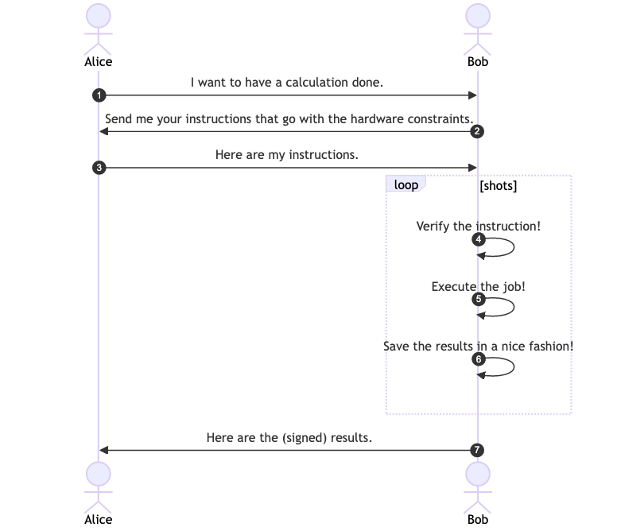
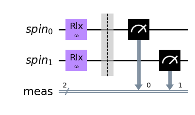
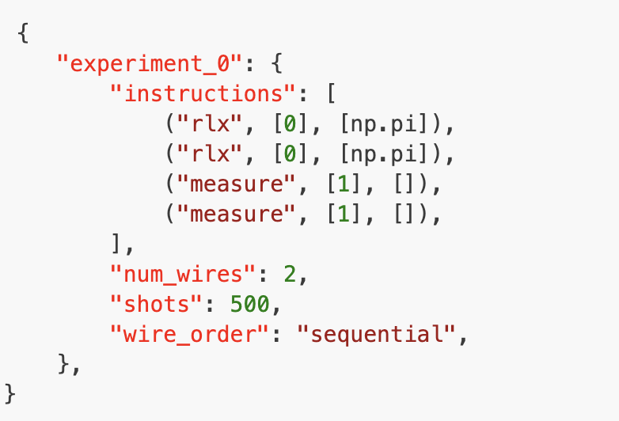
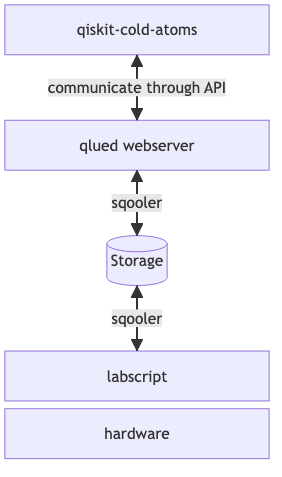

# Cloud control for cold atoms

Presented by

Fred Jendrzejewski, i.e. [fretchen](https://linktr.ee/fretchen)

---

## Why cold atoms ?


Cold atoms are:

- versatile with *many* different applications
- precise and accurate
- broadly used in research and industry
- a leading quantum information platform.

---

## The challenge



- Alice is the interested user
- Bob is the owner of the quantum hardware.
- Now they need to communicate in an efficient way.

---

## Alice first step

Write a quantum circuit in  `qiskit-cold-atoms`.

```python
Nwires = 2
qc_rabi = QuantumCircuit(QuantumRegister(Nwires, "spin"))

all_modes=range(Nwires)
omega_t = Parameter("ω")

qc_rabi.rlx(omega_t, [0, 1])

qc_rabi.measure_all()
qc_rabi.draw(output='mpl')
```



---

## Calculate it locally

For small circuits Alice can simply execute the code locally.
  
```python
from qiskit_cold_atom.spins import SpinSimulator

backend = SpinSimulator()
phases = np.linspace(0, 2*np.pi, 15)

rabi_list = [ qc_rabi.assign_parameters( {omega_t: phase},  inplace=False,  )  for phase in phases ]

n_shots = 500
job_rabi = backend.run(rabi_list, shots=n_shots)
result_rabi = job_rabi.result()
counts_rabi = result_rabi.get_counts()
```

- `SpinSimulator` is a local simulator for cold atoms and works for up to 10 spins.

---

## Choosing a cloud backend

For more complex problem Alice can send the code to a cloud backend with `ColdAtomProvider`.

```python
from qiskit_cold_atom.providers import ColdAtomProvider

cloud_backend = ColdAtomProvider()

job_remote_rabi = cloud_backend.run(remote_rabi_list, shots=500)
remote_result_rabi = job_rabi.result()
remote_counts_rabi = result_rabi.get_counts()
```

---

## Sending the json




- With `qiskit-cold-atoms` Alice sent a json file to the webserver.
- The webserver validates it and sends it to the queue of the cloud backend.
- All of this is done within the [qlued](https://github.com/Alqor-UG/qlued) framework.

---

## Executing the job

- The control PC for the cold atom device pulls the job from the queue.
- The job is executed on the cold atom device.
- The results are sent back to the storage.
- Alice can retrieve the results.
- All of this is done with the `sqooler` library that is installed on the control PC.

---

## Summary




Add nice colors for Alice and Bob such that it is recognizable who is doing what.