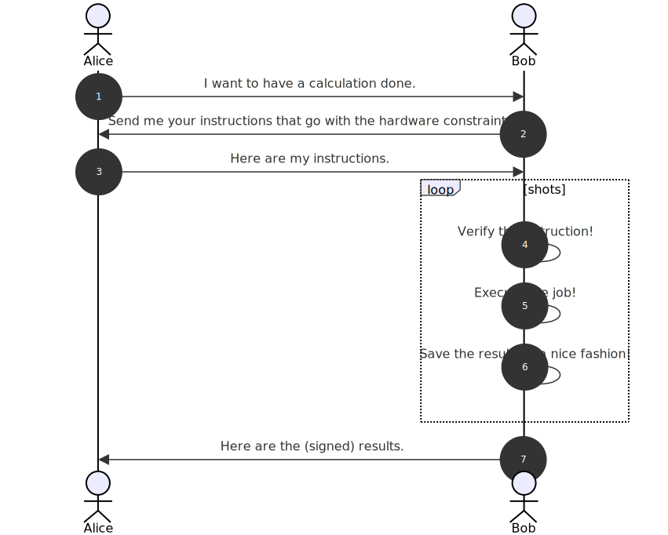

# Cloud control for cold atoms

Presented by

Fred J - aka [fretchen](https://linktr.ee/fretchen)

---

## Why cold atoms ?


Cold atoms are:

- versatile with *many* different applications
- precise and accurate
- broadly used in research and industry
- a leading quantum information platform.

---

## The challenge



-  <span style="color:#2ac082;">Alice</span>  is the interested user
- <span style="color:#ff9900;">Bob</span> is the owner of the quantum hardware.
- Now they need to communicate in an efficient way.

---

## <span style="color:#2ac082;">Alice</span> uses QISKIT

Write the quantum circuit in  
[qiskit-cold-atom](https://github.com/qiskit-community/qiskit-cold-atom).

```python
Nwires = 2
qc_rabi = QuantumCircuit(QuantumRegister(Nwires, "spin"))

all_modes=range(Nwires)
omega_t = Parameter("ω")

qc_rabi.rlx(omega_t, [0, 1])

qc_rabi.measure_all()
qc_rabi.draw(output='mpl')
```


---

## <span style="color:#2ac082;">Alice</span> calculates locally

For small circuits <span style="color:#2ac082;">Alice</span> can simply execute the code on her own machine.
  
```python
from qiskit_cold_atom.spins import SpinSimulator

backend = SpinSimulator()
phases = np.linspace(0, 2*np.pi, 15)

rabi_list = [ qc_rabi.assign_parameters( {omega_t: phase},  inplace=False,  )  for phase in phases ]

n_shots = 500
job_rabi = backend.run(rabi_list, shots=n_shots)
result_rabi = job_rabi.result()
counts_rabi = result_rabi.get_counts()
```

`SpinSimulator` is a local simulator for cold atoms and works for up to 10 spins.

---

## <span style="color:#2ac082;">Alice</span> chooses a cloud backend

For more complex problem <span style="color:#2ac082;">Alice</span> can send the code to a cloud backend with `ColdAtomProvider`.

```python
from qiskit_cold_atom.providers import ColdAtomProvider

cloud_backend = ColdAtomProvider()

job_remote_rabi = cloud_backend.run(remote_rabi_list, shots=500)
remote_result_rabi = job_rabi.result()
remote_counts_rabi = result_rabi.get_counts()
```

---

## <span style="color:#2ac082;">Alice</span> sends the json


- Alice sent a json file to the webserver.
- The webserver validates it and sends it to the queue of the cloud backend.
- All of this is done within the [qlued](https://github.com/Alqor-UG/qlued) framework.

---

## <span style="color:#ff9900;">Bob</span>  executes the job

- <span style="color:#ff9900;">Bob</span>  pulls the job from the queue to his control PC.
- He executes the job on the cold atom device, e.g. with [labscript](https://github.com/labscript-suite).
- The results are sent back to the storage.

---

## Summary


- <span style="color:#2ac082;">Alice</span> was able to write quantum circuits in the widely used QISKIT.
- <span style="color:#ff9900;">Bob</span> could control his machine through `labscript` software.
- Both could communicate through open source involving `qlued` and `sqooler`.